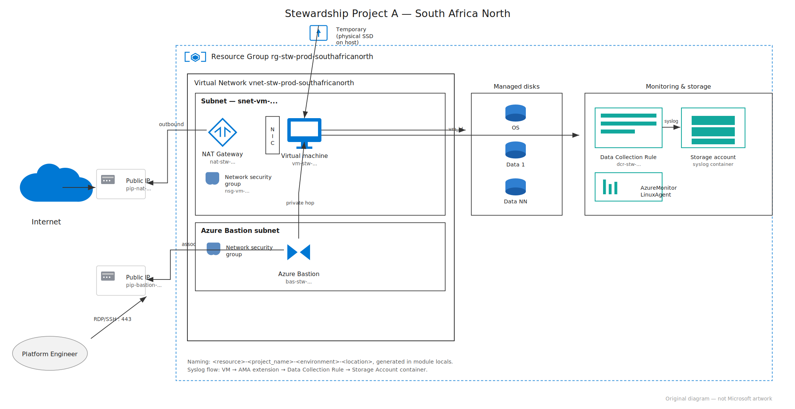

# stw-infra-live

The production environment for Stewardship "Project A". This repository does not create any resources of its own — it composes ten independently-versioned Terraform modules, each pinned to `v1.0.0`, and wires their outputs together to build the full environment.




## The problem

The original Project A codebase was a single monolithic Terraform configuration: one `main.tf`, every resource in one blast radius. A change to a Bastion rule required planning the entire environment, cost couldn't be attributed to a layer because nothing was separable, naming drifted between environments because it was typed by hand at each call site, and nothing was reusable — a second project would have meant copy-pasting the whole thing rather than consuming a module. This repository replaces that with ten single-responsibility modules composed here, so a change to monitoring, for example, plans and applies independently of a change to the network.

## Architecture

The diagram above shows the deployed topology: a Resource Group containing a Networking layer (VNet, VM subnet + NSG, Bastion subnet, a reusable Public IP module feeding both Bastion and NAT Gateway), a Compute layer (NIC, Linux VM, data disks), and a Storage & Monitoring layer (Storage Account + syslog container, and the Data Collection Rule that streams Syslog from the VM into it via the Azure Monitor Linux Agent extension). Source: [`docs/architecture.dot`](./docs/architecture.dot), rendered with Graphviz.

## Module composition table

| Layer | Module | Version | Consumes from upstream |
|---|---|---|---|
| Foundation | `stw-tf-resource-group` | `v1.0.0` | — |
| Networking | `stw-tf-vnet` | `v1.0.0` | `resource_group.resource_group_name` |
| Networking | `stw-tf-subnets-nsg` | `v1.0.0` | `resource_group.resource_group_name`, `vnet.vnet_name` |
| Networking | `stw-tf-public-ip` (×2: `bastion`, `nat`) | `v1.0.0` | `resource_group.resource_group_name` |
| Networking | `stw-tf-bastion` | `v1.0.0` | `resource_group.resource_group_name`, `vnet.vnet_name`, `bastion_pip.public_ip_id` |
| Networking | `stw-tf-nat-gateway` | `v1.0.0` | `resource_group.resource_group_name`, `nat_pip.public_ip_id`, `subnets_nsg.vm_subnet_id` |
| Storage | `stw-tf-storage-account` | `v1.0.0` | `resource_group.resource_group_name` |
| Compute | `stw-tf-vm-nic` | `v1.0.0` | `resource_group.resource_group_name`, `subnets_nsg.vm_subnet_id` |
| Compute | `stw-tf-data-disks` | `v1.0.0` | `resource_group.resource_group_name`, `vm.vm_id` |
| Monitoring | `stw-tf-monitoring-dcr` | `v1.0.0` | `resource_group.resource_group_name`, `vm.vm_id`, `storage_account.storage_account_id`, `storage_account.container_name` |

All dependencies flow through module outputs passed as inputs — there is no `depends_on` anywhere in this repository; Terraform resolves the graph from the references above.

## Tech stack

- Terraform `>= 1.5.0`
- azurerm provider `~> 3.90`
- Azure region: `southafricanorth` (South Africa North) — enforced by a `location` variable validation block in every child module
- Naming: `<resource>-<project_name>-<environment>-<location>`, generated in each module's `locals.tf` — never passed in as a raw name

## How to deploy it

1. **Prerequisites** — Terraform `>= 1.5.0`, an Azure subscription in South Africa North, and an SSH key pair (`ssh-keygen -t rsa -b 4096` if you don't have one).
2. **Authenticate** — `az login`, then `az account set --subscription <subscription-id>`. The azurerm provider picks up Azure CLI credentials automatically; no credentials are stored in this repository.
3. **Clone** this repository.
4. **Module sources** — every module `source` in `main.tf` is already pinned to `github.com/azimkayz/<module-repo>?ref=v1.0.0`. If you fork this and publish the modules under a different account, update those source URLs accordingly.
5. **Set variables** — either export `TF_VAR_admin_ssh_public_key` or create a `terraform.tfvars` (excluded by `.gitignore`) with at minimum:
   ```hcl
   project_name         = "projecta"
   environment           = "prod"
   admin_ssh_public_key  = "ssh-rsa AAAA... your-key"
   ```
6. **Deploy**:
   ```bash
   terraform init
   terraform plan
   terraform apply
   ```
7. **Connect** — once applied, connect to the VM through Azure Bastion in the Portal (Bastion does not require the VM to have a public IP).

A reviewer who has never seen this project should be able to follow these steps to a successful `apply` without asking a question. If any step above is wrong or missing something you needed, that's a documentation bug — not tribal knowledge you're expected to have.

## Evidence

Screenshots are in [`docs/screenshots`](./docs/screenshots), from an actual deployment (`project_name = "projecta"`, `environment = "prod"`, `location = "southafricanorth"`):

| # | Screenshot | What it shows |
|---|---|---|
| 1 | [`01-deployment-completed.png`](./docs/screenshots/01-deployment-completed.png) | Deployment completion summary for the environment. |
| 2 | [`02-terraform-plan.png`](./docs/screenshots/02-terraform-plan.png) | `terraform plan` resolving the full module graph with no errors. |
| 3 | [`03-terraform-apply.png`](./docs/screenshots/03-terraform-apply.png) | `terraform apply` completing successfully. |
| 4 | [`04-azure-portal-resource-group.png`](./docs/screenshots/04-azure-portal-resource-group.png) | The resource group in the Azure Portal — every resource name follows the `<resource>-projecta-prod-southafricanorth` pattern generated by module locals, confirming the naming convention holds end to end. |
| 5 | [`05-bastion-connection-success.png`](./docs/screenshots/05-bastion-connection-success.png) | A successful connection to the VM through Azure Bastion — confirming the Bastion + NSG + subnet chain is actually reachable, not just deployed. |
| 6 | [`06-ama-extension-provisioning-succeeded.png`](./docs/screenshots/06-ama-extension-provisioning-succeeded.png) | The `AzureMonitorLinuxAgent` VM extension reporting "Provisioning succeeded" — required before the DCR can collect anything. |
| 7 | [`07-dcr-association-linked-to-vm.png`](./docs/screenshots/07-dcr-association-linked-to-vm.png) | The Data Collection Rule showing the VM as an associated, collecting resource, with the Storage Account as its destination. |
| 8 | [`08-data-collection-configured.png`](./docs/screenshots/08-data-collection-configured.png) | The DCR's data source configuration — Syslog facilities and severity levels as set by the `monitoring-dcr` module inputs. |
| 9 | [`09-generated-logs-on-vm.png`](./docs/screenshots/09-generated-logs-on-vm.png) | Syslog activity generated on the VM to produce data for the pipeline to carry. |
| 10 | [`10-logs.png`](./docs/screenshots/10-logs.png) | Log output on the VM correlating with the events queried in Azure Monitor. |
| 11 | [`11-syslog-results-in-storage.png`](./docs/screenshots/11-syslog-results-in-storage.png) | A Log Analytics `Syslog` KQL query returning results from the VM — this is the specific outcome the Security Team asked for: syslog data landing centrally, not just an agent installed. |
| 12 | [`12-key-metrics.png`](./docs/screenshots/12-key-metrics.png) | Key VM metrics in Azure Monitor, confirming the monitoring stack is live beyond just the syslog pipeline. |

## Design decisions

- **Monitoring is a separate module from compute.** `monitoring-dcr` is applied to a VM after it exists, rather than embedding the DCR, association, and extension into `vm-nic`. The Security Team's controls can then change version independently of compute — bumping monitoring behaviour doesn't force a VM redeploy, and vice versa.
- **Public IP is standalone, not built into Bastion or NAT Gateway.** Both consumers need functionally the same resource (a Standard SKU static Public IP) with a different `purpose` tag baked into the name. One module with a `purpose` input avoided writing IP-allocation logic twice and kept both consumer modules focused only on what makes them different.
- **Names are generated in locals, never passed in.** Every module takes `project_name`, `environment`, `location`, and `resource_group_name` and derives the resource name internally. This is what makes the `<resource>-<project_name>-<environment>-<location>` convention actually hold across ten repositories written (and potentially reused) by different people — it can't drift because no caller can type a name directly.
- **`location` is validated, not just defaulted.** Every module rejects any value other than `southafricanorth` via a variable validation block. A default can be silently overridden; a validation block fails the plan, which is the behaviour a platform-wide region constraint actually needs.

## Challenges

- **DCR association ordering.** The Data Collection Rule Association and the `AzureMonitorLinuxAgent` VM extension both target the VM, but the DCR only starts collecting once the extension has finished provisioning. Terraform doesn't know about that runtime dependency implicitly — the fix was making sure the extension resource and the association both depend on `vm_id` from the same `vm-nic` output, and re-running `terraform apply` (or waiting) rather than treating a "not collecting" status in the Portal immediately after apply as a failure. The `06` and `07` screenshots above were taken after the extension reported "Provisioning succeeded", not before.
- **`AzureBastionSubnet` naming and size constraints.** Azure requires the Bastion subnet to be named exactly `AzureBastionSubnet` and refuses anything smaller than a `/26`. The `bastion` module hardcodes the name in `locals.tf` (rather than exposing it as an input, since it genuinely cannot vary) and defaults the prefix to a `/26`, while still allowing a caller to widen it.
- **Passing IDs versus names between modules.** Several modules need to reference a parent resource that's owned by another module — a subnet needs a VNet, a data disk needs a VM. The convention adopted throughout is: pass **names** where the consuming resource needs a name for its own API call (e.g. `vnet_name` into `subnets-nsg`), and pass **IDs** where the consuming resource needs a resource reference (e.g. `vm_id` into `data-disks` and `monitoring-dcr`). Mixing the two inconsistently across modules was the initial mistake — standardising on "id when it's a reference, name when it's a scope" is what made the outputs tables in each child README predictable to write.

## What I would do differently

- **Remote state with locking.** This repository currently runs with local state. A production platform needs an Azure Storage Account backend with state locking so two people (or two CI runs) can't apply concurrently and corrupt state.
- **Secrets in Key Vault, not `tfvars`.** `admin_ssh_public_key` is a public key so it's low-risk, but the pattern doesn't generalise — any future secret input should come from Azure Key Vault via a data source and a managed identity, not a `.tfvars` file a developer has to remember not to commit.
- **CI on every pull request.** `terraform fmt -check`, `terraform validate`, and a `terraform plan` posted as a PR comment on every module and on this repository, so a broken module is caught before it's tagged `v1.0.0`, not after someone else has already pinned to it.
